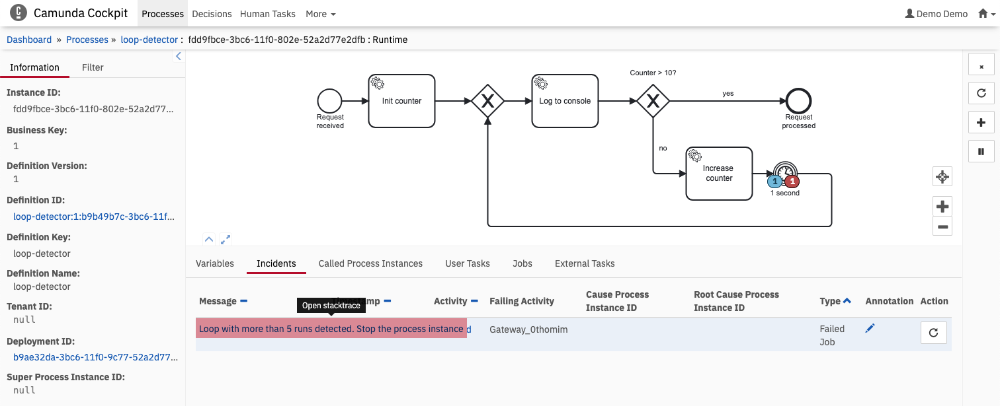

# Loop detection with Execution listener

Example Spring Boot Application using [Camunda 7](http://docs.camunda.org).

This project has been generated by the Maven archetype
[camunda-archetype-spring-boot-7.23.0](https://docs.camunda.org/manual/latest/user-guide/process-applications/maven-archetypes/).

It shows an example to detect loops in running process instances and stop them, if the loop has run too often.

## Show me the important parts!
[BPMN Process](src/main/resources/process.bpmn)


## How does it work?

The [Execution Listener](src/main/java/com/camunda/consulting/loop_detector/plugin/LoopDetectionListener.java) queries the history of the task, how often it has been executed so far.
If the count is higher than a given maximum, it throws an exception.
This will roll back to the latest wait state and raise an incident in Cockpit.

A [parse listener](src/main/java/com/camunda/consulting/loop_detector/plugin/LoopDetectorParseListener.java) adds the execution listener to each exclusive gateway in every deployed process.

Finally, a [process engine plugin](src/main/java/com/camunda/consulting/loop_detector/plugin/LoopDetectionEnginePlugin.java) wires the parse listener in the `ProcessEngineConfiguration`. Each time, a process model is loaded into the engine, the execution listener is added to the desired BPMN elements.

This is a brute-force way and can be extended in the Parse Listener implementation to apply for fewer activities.

You can:
* Filter for some process definitions
* Try to select only joining gateways with multiple incoming sequence flows
* Check for a given property
* ...

The cost of this listener is a database query against the historic activity table. The real cost depends on the number of activities and the maximum that you look for. 

This snippet is inspired by the [parse listener process engine plugin example](https://github.com/camunda/camunda-bpm-examples/tree/master/process-engine-plugin/bpmn-parse-listener).

## How to use it?

### Running the application
You can also build and run the process application with Spring Boot.

#### Manually
1. Build the application using:

```bash
mvn clean package
```
2. Run the *.jar file from the `target` directory using:

```bash
java -jar target/loop-detector.jar
```

For a faster 1-click (re-)deployment see the alternatives below.

#### Maven Spring Boot Plugin
1. Build and deploy the process application using:

```bash
mvn clean package spring-boot:run
```

#### Your Java IDE
1. Run the project as a Java application in your IDE using CamundaApplication as the main class.

### Run and Inspect with Tasklist and Cockpit
Once you deployed the application you can run it using
[Camunda Tasklist](http://docs.camunda.org/latest/guides/user-guide/#tasklist)
and inspect it using
[Camunda Cockpit](http://docs.camunda.org/latest/guides/user-guide/#cockpit).

## Environment Restrictions
Built and tested against Camunda Platform version 7.23.0.
Requires JDK 17.

## Known Limitations

## License
[Apache License, Version 2.0](http://www.apache.org/licenses/LICENSE-2.0).

<!-- Tweet
New @Camunda example: Camunda Spring Boot Application - Spring Boot Application using [Camunda](http://docs.camunda.org). https://github.com/camunda-consulting/code/tree/master/snippets/loop-detector
-->
